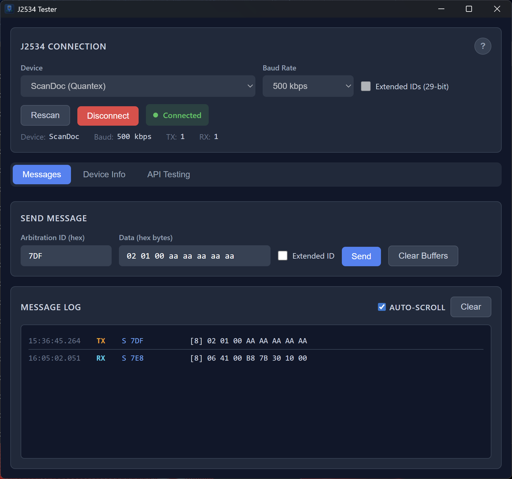

# Jester

**An opinionated J2534-DLL-Tester**

Jester is a diagnostic tool for testing and validating J2534 PassThru devices and their DLL implementations. Built with [Tauri](https://tauri.app/) and React.



## Features

- **Fault-Isolated Architecture** - All J2534 DLLs run in a separate bridge process. If a buggy DLL crashes, your app keeps running
- **Cross-Bitness Support** - 64-bit Jester can load 32-bit DLLs (and vice versa) seamlessly via the bridge
- Connect to any J2534-compliant PassThru device
- Send and receive CAN messages in real-time
- Monitor message traffic with detailed logging
- Test periodic messages and message filters
- Read device information and voltage levels
- Configure protocol parameters (baud rate, loopback, etc.)
- Supports both standard (11-bit) and extended (29-bit) CAN IDs
- Works with USB and WiFi-based J2534 adapters
- Batch test pauses live polling to avoid consuming loopback echoes

## Requirements

- Windows 10/11 (J2534 is a Windows-only standard)
- A J2534-compliant PassThru device with its driver installed

## Installation

Download the latest release from the [Releases](https://github.com/mickeyl/Jester/releases) page.

## Building from Source

### Prerequisites

- [Node.js](https://nodejs.org/) (v18 or later)
- [Rust](https://rustup.rs/) (latest stable)
- [Tauri CLI](https://tauri.app/v1/guides/getting-started/prerequisites)

### Build Steps

```bash
# Install dependencies
make install

# Setup Rust targets (first time only)
make setup-targets

# Run in development mode (64-bit)
make dev64

# Run in development mode (32-bit)
make dev32

# Build for production
make build64   # or make build32
```

## Usage

1. Launch Jester
2. Select your J2534 device from the dropdown
3. Choose the appropriate baud rate for your vehicle/ECU
4. Click **Connect**
5. Use the **Messages** tab to send and receive CAN frames
6. Use **Device Info** to view adapter details and voltage readings
7. Use **API Testing** to test periodic messages, filters, and configuration parameters
8. Use **Batch Test** for high-volume loopback checks (live log polling pauses automatically)

## License

MIT License - see [LICENSE](LICENSE) for details.

## Contributing

Contributions are welcome! Please feel free to submit a Pull Request.
